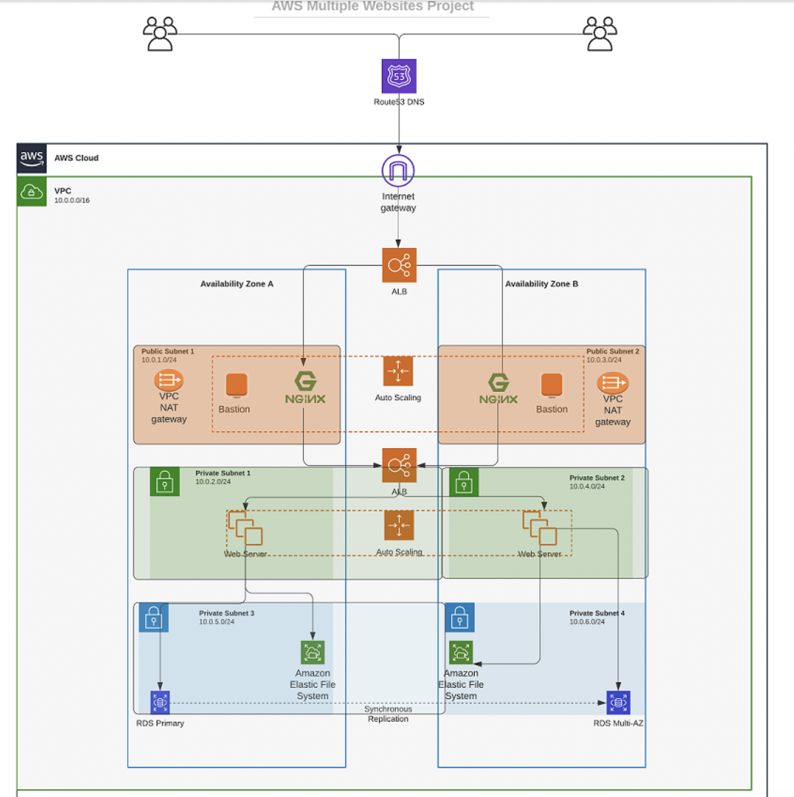

# Automate-infrastructure-using-terraform
This project shows how the set up of an AWS infrastructure for two websites can be automated using Terrafoam. In this project, I shall be building a secure and and resilient 3 Tier infrastructure inside our own AWS Virtual Private Cloud network.

The image above demostrates the 3 tier architecture in this project.
- Tier 1: Public Subnet, hosting the bastion server nad NAT gateway
- Tier 2: Private Subnet, hosting webservers
- Tier 3: Data Layer, hosting Elastic File System EFS and RDS database
 
 The following resources highlighted below will be used to set up the infrastructure for this project

 1. S3 bucket will be used to store Terraform state file.
 2. Bastion host in the public subnet to enable SSH access into other webservers.
 3. VPC will be set-up to isolate the infrastructure in the cloud.
 4. Route53 DNS which will make use of custom domain name and an eentry point to the loadbalancer.
 5. Private and Public subnets for grouping the resources as needed across the avialability zones
 6. Elastic load balancer to route the traffic to the highly avaialable  nginx reverse proxy server
 7. Launch template for autoscaling group.
 8. Target groups for load balancer.
 9. Security groups associated to resources and configured to only allow certain type of traffic from certain ports or IP's.
 10. Internet gateway for the public subnet to be routable.
 11. NAT gataeway to give internet access to the private subnet.
 12. Autoscaling group for the nginx server and webservers 

