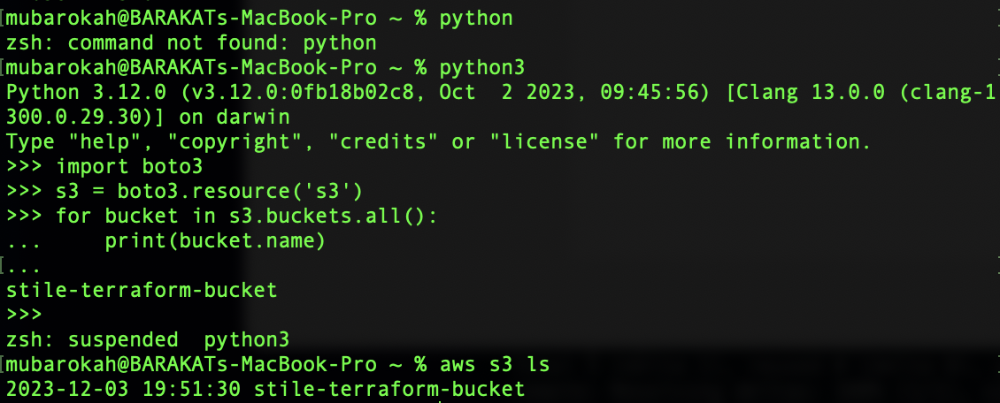
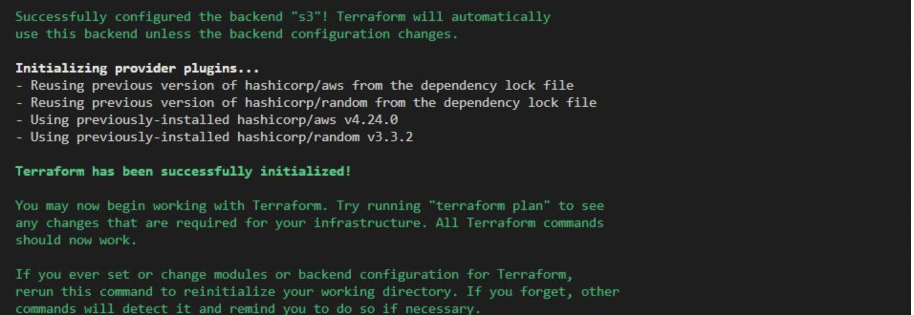
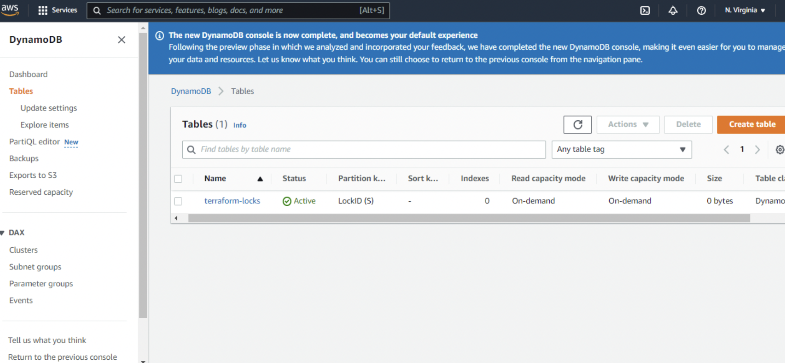
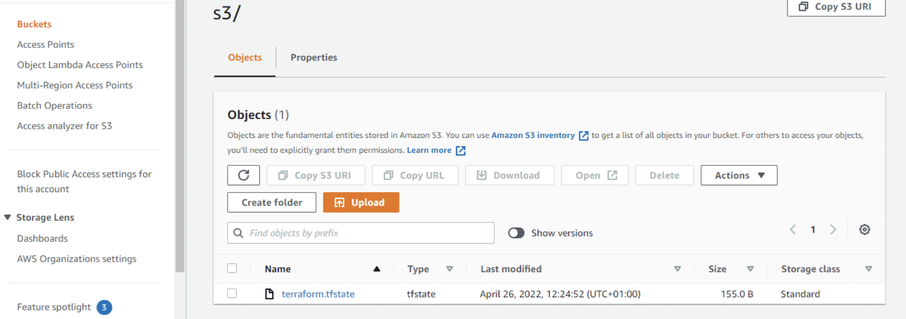

# Automate-infrastructure-using-terraform
This project shows how the set up of an AWS infrastructure for two websites can be automated using Terrafoam. In this project, I shall be building a secure and and resilient 3 Tier infrastructure inside our own AWS Virtual Private Cloud network.


The image above demostrates the 3 tier architecture in this project.
- Tier 1: Public Subnet, hosting the bastion server nad NAT gateway
- Tier 2: Private Subnet, hosting webservers
- Tier 3: Data Layer, hosting Elastic File System EFS and RDS database
 
 The following resources highlighted below will be used to set up the infrastructure for this project

 1. S3 bucket will be used to store Terraform state file.
 2. Bastion host in the public subnet to enable SSH access into other webservers.
 3. VPC will be set-up to isolate the infrastructure in the cloud.
 4. Route53 DNS which will make use of custom domain name and an eentry point to the loadbalancer.
 5. Private and Public subnets for grouping the resources as needed across the avialability zones
 6. Elastic load balancer to route the traffic to the highly avaialable  nginx reverse proxy server
 7. Launch template for autoscaling group.
 8. Target groups for load balancer.
 9. Security groups associated to resources and configured to only allow certain type of traffic from certain ports or IP's.
 10. Internet gateway for the public subnet to be routable.
 11. NAT gataeway to give internet access to the private subnet.
 12. Autoscaling group for the nginx server and webservers 

 EVENTS OF THE PROJECT
 
 - I created an IAM user, named stile and granted the stile  administrativeaccess permissions.
 - I created secret access key adn access ID for the user.
 - I created an amazon S3 bucket for storing terraform statefile
 - I installed AWS SDK for python, to integrate python application with AWS services.
 - I ran the following command to check if i can progrmatically access AWS services ussing AWS CLI
    
    ` import boto3
s3 = boto3.resource('s3')
for bucket in s3.buckets.all():
    print(bucket.name)`


   

   - I created a folder named 'Terraform-project'. I added a file named 'main.tf'in this folder.

   - Added the following variables to declare AWS as the provider.

   
   # Configure the AWS Provider
    `
     provider "aws" {
        region = "us-east-1"
     }`

   -  I stored the desired VPC CIDR range in a variable

   `variable "vpc_cidr" {
        default = "172.16.0.0/16"
    }`


    - I stored other desired VPC configuration in a variable.
   
   ```
    variable "enable_dns_support" {
        default = "true"
    }    

    variable "enable_dns_hostnames" {
        default ="true" 
    }

   variable "enable_classiclink" {
        default = "false"
    }

   variable "enable_classiclink_dns_support" {
        default = "false"
    }
    ```

    - To create VPC

   ```
    resource "aws_vpc" "main" {
   cidr_block                     = var.vpc_cidr
   enable_dns_support             = var.enable_dns_support
   enable_dns_hostnames           = var.enable_dns_hostnames
   enable_classiclink             = var.enable_classiclink
   enable_classiclink_dns_support = var.enable_classiclink_dns_support
   }```

  - Declared a variable to store the number of desired public subnet and set the default value

    ` variable "preferred_number_of_public_subnets" {
      default = 2 
   }`


  - Create Public Subnets 

  # Create public subnets

  ```
  resource "aws_subnet" "public" {
  count  = var.preferred_number_of_public_subnets == null ? length(data.aws_availability_zones.available.names) : var.preferred_number_of_public_subnets   
  vpc_id = aws_vpc.main.id
  cidr_block              = cidrsubnet(var.vpc_cidr, 4 , count.index)
  map_public_ip_on_launch = true
  availability_zone       = data.aws_availability_zones.available.names[count.index]
   }
```

   The first part var.preferred_number_of_public_subnets == null checks if the value of the variable is set to null or has some value defined.
   The second part ? and length(data.aws_availability_zones.available.names) means, if the first part is true, then use this. In other words, if preferred number of public subnets is null (Or not known) then set the value to the data returned by lenght function.
   The third part : and  var.preferred_number_of_public_subnets means, if the first condition is false, i.e preferred number of public subnets is not null then set the value to whatever is definied in var.preferred_number_of_public_subnets

   - Testing the configuration

      `terraform plan`

 


 - To make my code appear more readable and well structured,  I created a new file called variables.tf and copied all the variable declarations into it from main.tf. I created another file named terraform.tfvars and set values for each of the variables. 

      # - Main.tf

 ```
       Get list of availability zones
       data "aws_availability_zones" "available" {
       state = "available"
       }
       provider "aws" {
        region = var.region
       }
      Create VPC
      resource "aws_vpc" "main" {
      cidr_block                     = var.vpc_cidr
      enable_dns_support             = var.enable_dns_support 
      enable_dns_hostnames           = var.enable_dns_support
      enable_classiclink             = var.enable_classiclink
      enable_classiclink_dns_support = var.enable_classiclink
      }
      Create public subnets
      resource "aws_subnet" "public" {
      count  = var.preferred_number_of_public_subnets == null ? length(data.aws_availability_zones.available.names) : var.preferred_number_of_public_subnets   
      vpc_id = aws_vpc.main.id
      cidr_block              = cidrsubnet(var.vpc_cidr, 4 , count.index)
      map_public_ip_on_launch = true
      availability_zone       = data.aws_availability_zones.available.names[count.index]
       }
```


 # -Variable.tf
   
    ```
     variable "region" {
     default = "us-east-1"
    }
     variable "vpc_cidr" {
     default = "172.16.0.0/16"
    }

     variable "enable_dns_support" {
     default = "true"
    }

     variable "enable_dns_hostnames" {
     default ="true" 
    }

     variable "enable_classiclink" {
     default = "false"
    }

     variable "enable_classiclink_dns_support" {
     default = "false"
    }
   
     variable "desires_number_of_public_subnet" {
    
    }

     variable "preferred_number_of_public_subnets" {
      default = null 
    } ```

   # - Terraform.tfvars

  ```
    region = "us-east-1"

    vpc_cidr = "172.16.0.0/16" 

    enable_dns_support = "true" 

    enable_dns_hostnames = "true"  

    enable_classiclink = "false" 

    enable_classiclink_dns_support = "false" 

    preferred_number_of_public_subnets = 2

  ```

        `Terraform apply`

 


    
    Infrastructure created sucessfully

    VPC
    
   

    PUBLIC SUBNETS

  

  ## The next action is to create four private subnets in the VPC.

  Note: According to the architecture of this project, the subnets are present within two availability zones.Therefore i needed to introduce modular logic to the count index of the availability zone.

  ``resource "aws_subnet" "Private" {
  count  = var.preferred_number_of_private_subnets == null ? length(data.aws_availability_zones.available.names) : var.preferred_number_of_private_subnets   
  vpc_id = aws_vpc.main.id
  cidr_block              = cidrsubnet(var.vpc_cidr, 4 , count.index)
  map_public_ip_on_launch = false
  availability_zone       = data.aws_availability_zones.available.names[count.index % 2]
}``

 

   ## Create Internet-Gateway

  The format funtion wil be used in order to name the resource uniquely in the provider, According to the code below, The first placeholder interpolates the value of the VPC id and the second placeholder takes the literal string of IG.

  ``` resource "aws_internet_gateway" "ig" {
    vpc_id = aws_vpc.main.id

    tags = merge(
        var.tags,
        {
            Name = format("%s-%s!", aws_vpc.main.id,"IG")
        }

    )

  
}
```


   ## Create NAT-Gateway
      
      The Nat-Gateway, which allow the resources connectes to it to initiate outbound traffic while preventing inbound traffic to these resources. Cretaed one nat-gateway and an elastic-IP (EIP) that will be attached to the Nat-Gateway.


  ```
      resource "aws_eip" "nat_eip" {
    vpc = true
    depends_on = [ aws_internet_gateway.ig ]


    tags = merge(
        var.tags,

        {
            name = format ("%S-EIP", var.name)
        },
    )
  
}
  resource "awz_nat_gateway" "nat" {
  allocation_id = (aws_eip.nat_eip.id)
  subnet_id = element(aws_subnet_public.*.id,0)
  depends_on = [ aws_internet_gateway.ig ]

  tags = merge(
    var.tags,
    {
        name = format ("%s-NAT", var.name)
    },
  )
 
  }
  ```


   ## AWS-Routes

   Routes needs to be created for both public and private subnets. The public and private route table will be created, and private and public dubnets will be associated to them respectively.

   # Create private route table 

   ```
   resource "aws_route_table" "private-rtb" {
  vpc_id = aws_vpc.main.id

  tags = merge(
    var.tags,
    {
      Name = format("%s-Private-Route-Table", var.name)
    },
  )
}
```

# Associate all private subnets to the private route table

```
resource "aws_route_table_association" "private-subnets-assoc" {
  count          = length(aws_subnet.private[*].id)
  subnet_id      = element(aws_subnet.private[*].id, count.index)
  route_table_id = aws_route_table.private-rtb.id
}
```

# Create public route table

resource "aws_route_table" "public-rtb" {
    vpc_id = aws_vpc.main.id

    tags = merge (
        var.tags,

        {
            name = format("$s-public-route-table", var.name)
        }
    )
   
}
  

# Associate all public subnets to public route table

```
resource "aws_route_table_association" "public_subnets_assoc" {
    count = length(aws_subnet.public[*].id)
    subnet_id = element(aws_subnet.public[*].id,count.index)
    route_table_id = aws_route_table.public-rtb.id
  
}
```

# Create route for the public route-table and attach  it to the internet gateway

```
resource "aws_route" "public-rtb-route" {
    route_table_id = aws_route_table.public-rtb.id
    destination_cidr_block = "0.0.0.0/0"
    gateway_id = aws_internet_gateway.ig.id
  
}
```

- `Running Terraform apply` authomatically sets the following up

– Our main vpc
– 2 Public subnets
– 4 Private subnets
– 1 Internet Gateway
– 1 NAT Gateway
– 1 Elastic IP for the NAT Gateway
– 2 Route tables for private and public subnets


The above set up sums up the network aspect of this project.

 ## Access control configuration.

  I will pass an IAM role or EC2 instances to give them access to some specific resources. 
  - An ASSUMEROLE will be created
  Assume Role uses Security Token Service (STS) API that returns a set of temporary security credentials that you can use to access AWS resources that you may not normally have access to. These temporary credentials consist of an access key ID, a secret access key, and a security token. Typically, you use AssumeRole within your account or for cross-account access.
    I created a file named roles.tf and added the following in to the file.

    ## IAMROLE resource block

    ```
    resource "aws_iam_role" "ec2_instance_role" {
        name = "ec2_instance_role"
         assume_role_policy = jsonencode({
        Version = "2012-10-17"
          Statement = [
      {
        Action = "sts:AssumeRole"
        Effect = "Allow"
        Sid    = ""
        Principal = {
          Service = "ec2.amazonaws.com"
        }
      },
    ]
     })

     tags = merge(
    var.tags,
     {
      Name = "aws assume role"
     },
    )
      }
       ```

    
    # Creating a policy for the role, this is where permissions are decleared for the desired requirments.

       ```
      resource "aws_iam_policy" "policy" {
       name        = "ec2_instance_policy"
       description = "A test policy"
       policy = jsonencode({
       Version = "2012-10-17"
         Statement = [
        {
        Action = [
           "ec2:Describe*",
        ]
        Effect   = "Allow"
        Resource = "*"
          },
       ]

         })

       tags = merge(
        var.tags,
            {
      Name =  "aws assume policy"
        },
        )

       }
      ```

      ## Attaching the policy to the iamrole

      ```
      resource "aws_iam_role_policy_attachment" "test-attach" {
        role       = aws_iam_role.ec2_instance_role.name
        policy_arn = aws_iam_policy.policy.arn
      }
      ```


## Creating an Instance Profile and interpolate the IAM Role
    
    ```
    resource "aws_iam_instance_profile" "ip" {
        name = "aws_instance_profile_test"
        role =  aws_iam_role.ec2_instance_role.name
    }
    ```


## Having set up the identity and the access management, it is time to configure the following resources.

    According to the architecture of this  project, the following resources will be created.

    -Create  Security Groups.
    -Create Target Group for Nginx, Wordpress and Tooling.
    -Create certificate from AWS certificate manager. 
    -Create an External Application Load Balancer and Internal Application Load Balancer.
    -create launch template for Bastion, Tooling, Nginx and Wordpress.
    -Create an Auto Scaling Group (ASG)  for Bastion, Tooling, Nginx and Wordpress.
    -Create Elastic Filesystem.
    -Create Relational Database (RDS)

    I cretaed a file named security_group.tf and added the following to set up the neccesary security group neede for this project.

##  Security group for alb, to allow acess from any where for HTTP and HTTPS traffic

```
resource "aws_security_group" "ext-alb-sg" {
  name        = "ext-alb-sg"
  vpc_id      = aws_vpc.main.id
  description = "Allow TLS inbound traffic"

  ingress {
    description = "HTTP"
    from_port   = 80
    to_port     = 80
    protocol    = "tcp"
    cidr_blocks = ["0.0.0.0/0"]
  }

  ingress {
    description = "HTTPS"
    from_port   = 22
    to_port     = 22
    protocol    = "tcp"
    cidr_blocks = ["0.0.0.0/0"]
  }

  egress {
    from_port   = 0
    to_port     = 0
    protocol    = "-1"
    cidr_blocks = ["0.0.0.0/0"]
  }

 tags = merge(
    var.tags,
    {
      Name = "ext-alb-sg"
    },
  )

}
```


# security group for bastion, to allow access into the bastion host from you IP

```
resource "aws_security_group" "bastion_sg" {
  name        = "vpc_web_sg"
  vpc_id = aws_vpc.main.id
  description = "Allow incoming HTTP connections."

  ingress {
    description = "SSH"
    from_port   = 22
    to_port     = 22
    protocol    = "tcp"
    cidr_blocks = ["0.0.0.0/0"]
  }

  egress {
    from_port   = 0
    to_port     = 0
    protocol    = "-1"
    cidr_blocks = ["0.0.0.0/0"]
  }

   tags = merge(
    var.tags,
    {
      Name = "Bastion-SG"
    },
  )
}
```


## security group for nginx reverse proxy, to allow access only from the external load balancer and bastion instance

```
 resource "aws_security_group" "nginx-sg" {
  name   = "nginx-sg"
  vpc_id = aws_vpc.main.id

  egress {
    from_port   = 0
    to_port     = 0
    protocol    = "-1"
    cidr_blocks = ["0.0.0.0/0"]
  }

   tags = merge(
    var.tags,
    {
      Name = "nginx-SG"
    },
  )
}

resource "aws_security_group_rule" "inbound-nginx-http" {
  type                     = "ingress"
  from_port                = 443
  to_port                  = 443
  protocol                 = "tcp"
  source_security_group_id = aws_security_group.ext-alb-sg.id
  security_group_id        = aws_security_group.nginx-sg.id
}

resource "aws_security_group_rule" "inbound-bastion-ssh" {
  type                     = "ingress"
  from_port                = 22
  to_port                  = 22
  protocol                 = "tcp"
  source_security_group_id = aws_security_group.bastion_sg.id
  security_group_id        = aws_security_group.nginx-sg.id
} 


# security group for ialb, to have access only from nginx reverser proxy server
resource "aws_security_group" "int-alb-sg" {
  name   = "my-alb-sg"
  vpc_id = aws_vpc.main.id

  egress {
    from_port   = 0
    to_port     = 0
    protocol    = "-1"
    cidr_blocks = ["0.0.0.0/0"]
  }

  tags = merge(
    var.tags,
    {
      Name = "int-alb-sg"
    },
  )

}

resource "aws_security_group_rule" "inbound-ialb-https" {
  type                     = "ingress"
  from_port                = 443
  to_port                  = 443
  protocol                 = "tcp"
  source_security_group_id = aws_security_group.nginx-sg.id
  security_group_id        = aws_security_group.int-alb-sg.id
}
```

 
## security group for webservers, to have access only from the internal load balancer and bastion instance
 
 ```
 resource "aws_security_group" "webserver-sg" {
  name   = "my-asg-sg"
  vpc_id = aws_vpc.main.id

  egress {
    from_port   = 0
    to_port     = 0
    protocol    = "-1"
    cidr_blocks = ["0.0.0.0/0"]
  }

  tags = merge(
    var.tags,
    {
      Name = "webserver-sg"
    },
  )

}

resource "aws_security_group_rule" "inbound-web-https" {
  type                     = "ingress"
  from_port                = 443
  to_port                  = 443
  protocol                 = "tcp"
  source_security_group_id = aws_security_group.int-alb-sg.id
  security_group_id        = aws_security_group.webserver-sg.id
}

resource "aws_security_group_rule" "inbound-web-ssh" {
  type                     = "ingress"
  from_port                = 22
  to_port                  = 22
  protocol                 = "tcp"
  source_security_group_id = aws_security_group.bastion_sg.id
  security_group_id        = aws_security_group.webserver-sg.id
}
```


## security group for datalayer to alow traffic from websever on nfs and mysql port and bastion host on mysql port

```
 resource "aws_security_group" "datalayer-sg" {
  name   = "datalayer-sg"
  vpc_id = aws_vpc.main.id

  egress {
    from_port   = 0
    to_port     = 0
    protocol    = "-1"
    cidr_blocks = ["0.0.0.0/0"]
  }

 tags = merge(
    var.tags,
    {
      Name = "datalayer-sg"
    },
  )
}

resource "aws_security_group_rule" "inbound-nfs-port" {
  type                     = "ingress"
  from_port                = 2049
  to_port                  = 2049
  protocol                 = "tcp"
  source_security_group_id = aws_security_group.webserver-sg.id
  security_group_id        = aws_security_group.datalayer-sg.id
}

resource "aws_security_group_rule" "inbound-mysql-bastion" {
  type                     = "ingress"
  from_port                = 3306
  to_port                  = 3306
  protocol                 = "tcp"
  source_security_group_id = aws_security_group.bastion_sg.id
  security_group_id        = aws_security_group.datalayer-sg.id
}

resource "aws_security_group_rule" "inbound-mysql-webserver" {
  type                     = "ingress"
  from_port                = 3306
  to_port                  = 3306
  protocol                 = "tcp"
  source_security_group_id = aws_security_group.webserver-sg.id
  security_group_id        = aws_security_group.datalayer-sg.id
}
```

  ## Created Certificate From Amazon Cerificate Manager

  - Certificate.tf was created and the following code snippet was added to configure certificate (TLS/SSL).
  I will have to create certificate, public zone and validate the certificate using DNS method.

   ## Create the certificate using a wildcard for all the domains created in mbarokah.website
  
  ```
  resource "aws_acm_certificate" "mbarokah" {
  domain_name       = "*.mbarokah.website"
  validation_method = "DNS"
  }
  ```

# calling the hosted zone

```
data "aws_route53_zone" "mbarokah" {
  name         = "mbarokah.website"
  private_zone = false
}
```

# selecting validation method

```
resource "aws_route53_record" "mbarokah" {
  for_each = {
    for dvo in aws_acm_certificate.mbarokah.domain_validation_options : dvo.domain_name => {
      name   = dvo.resource_record_name
      record = dvo.resource_record_value
      type   = dvo.resource_record_type
    }
  }

  allow_overwrite = true
  name            = each.value.name
  records         = [each.value.record]
  ttl             = 60
  type            = each.value.type
  zone_id         = data.aws_route53_zone.mbarokah.zone_id
}
```

# validate the certificate through DNS method

```
resource "aws_acm_certificate_validation" "mbarokah" {
  certificate_arn         = aws_acm_certificate.mbarokah.arn
  validation_record_fqdns = [for record in aws_route53_record.mbarokah : record.fqdn]
}
```

# create records for tooling

```
resource "aws_route53_record" "tooling" {
  zone_id = data.aws_route53_zone.mbarokah.zone_id
  name    = "tooling.mbarokah.website"
  type    = "A"

  alias {
    name                   = aws_lb.ext-alb.dns_name
    zone_id                = aws_lb.ext-alb.zone_id
    evaluate_target_health = true
  }
}
```

# create records for wordpress

```
resource "aws_route53_record" "wordpress" {
  zone_id = data.aws_route53_zone.mbarokah.zone_id
  name    = "wordpress.mbarokah.website"
  type    = "A"

  alias {
    name                   = aws_lb.ext-alb.dns_name
    zone_id                = aws_lb.ext-alb.zone_id
    evaluate_target_health = true
  }
}
```


## Create an external (Internet facing) Application Load Balancer (ALB)

- Creating an ALB to balance the traffic between the Instances:

  ```
  resource "aws_lb" "ext-alb" {
  name     = "ext-alb"
  internal = false
  security_groups = [
    aws_security_group.ext-alb-sg.id,
  ]

  subnets = [
    aws_subnet.public[0].id,
    aws_subnet.public[1].id
  ]

   tags = merge(
    var.tags,
    {
      Name = "ACS-ext-alb"
    },
  )

  ip_address_type    = "ipv4"
  load_balancer_type = "application"
  }
  ```

  ## To inform the ALB where to route the traffic. I needed to create a Target Group to point to its targets. The target in this case is the nginx reverse proxy server.

```
  resource "aws_lb_target_group" "nginx-tgt" {
  health_check {
    interval            = 10
    path                = "/healthstatus"
    protocol            = "HTTPS"
    timeout             = 5
    healthy_threshold   = 5
    unhealthy_threshold = 2
  }
  name        = "nginx-tgt"
  port        = 443
  protocol    = "HTTPS"
  target_type = "instance"
  vpc_id      = aws_vpc.main.id
}
```
  ## Creating a listener for the target group.

 ```
  resource "aws_lb_listener" "nginx-listner" {
  load_balancer_arn = aws_lb.ext-alb.arn
  port              = 443
  protocol          = "HTTPS"
  certificate_arn   = aws_acm_certificate_validation.oyindamola.certificate_arn

  default_action {
    type             = "forward"
    target_group_arn = aws_lb_target_group.nginx-tgt.arn
  }
}
```

## Added the following code snippet to output.tf to print them on screen

```
output "alb_dns_name" {
  value = aws_lb.ext-alb.dns_name
}

output "alb_target_group_arn" {
  value = aws_lb_target_group.nginx-tgt.arn
}
```

## Create an Internal (Internal) Application Load Balancer (ALB)

The same concept as the external load balancer will be followed.

- Next,I will create the Auto Scaling Groups (ASG) for nginx, bastion, wordpress and tooling

This will be in asg-bastion-nginx.tf and asg-webserver.tf

- The following code snippet was added to asg-bastion-nginx

# creating sns topic for all the auto scaling groups
```
resource "aws_sns_topic" "david-sns" {
 name = "Default_CloudWatch_Alarms_Topic"
}
```

# creating notification for all the auto scaling groups

```
resource "aws_autoscaling_notification" "david_notifications" {
 group_names = [
   aws_autoscaling_group.bastion-asg.name,
   aws_autoscaling_group.nginx-asg.name,
   aws_autoscaling_group.wordpress-asg.name,
   aws_autoscaling_group.tooling-asg.name,
 ]
 notifications = [
   "autoscaling:EC2_INSTANCE_LAUNCH",
   "autoscaling:EC2_INSTANCE_TERMINATE",
   "autoscaling:EC2_INSTANCE_LAUNCH_ERROR",
   "autoscaling:EC2_INSTANCE_TERMINATE_ERROR",
 ]

 topic_arn = aws_sns_topic.david-sns.arn
}


resource "random_shuffle" "az_list" {
 input        = data.aws_availability_zones.available.names
}
```


# launch template for bastion

```
resource "aws_launch_template" "bastion-launch-template" {
 image_id               = var.ami
 instance_type          = "t2.micro"
 vpc_security_group_ids = [aws_security_group.bastion_sg.id]

 iam_instance_profile {
   name = aws_iam_instance_profile.ip.id
 }

 key_name = var.keypair

 placement {
   availability_zone = "random_shuffle.az_list.result"
 }

 lifecycle {
   create_before_destroy = true
 }

 tag_specifications {
   resource_type = "instance"

  tags = merge(
   var.tags,
   {
     Name = "bastion-launch-template"
   },
 )
 }
 ```


  # create a file called bastion.sh and copy the bastion userdata from project 15 into it
  ```
 user_data = filebase64("${path.module}/bastion.sh")
}
```


# ---- Autoscaling for bastion  hosts

```
resource "aws_autoscaling_group" "bastion-asg" {
 name                      = "bastion-asg"
 max_size                  = 2
 min_size                  = 1
 health_check_grace_period = 300
 health_check_type         = "ELB"
 desired_capacity          = 1

 vpc_zone_identifier = [
   aws_subnet.public[0].id,
   aws_subnet.public[1].id
 ]


 launch_template {
   id      = aws_launch_template.bastion-launch-template.id
   version = "$Latest"
 }
 tag {
   key                 = "Name"
   value               = "bastion-launch-template"
   propagate_at_launch = true
 }

}
```


# launch template for nginx

```

resource "aws_launch_template" "nginx-launch-template" {
 image_id               = var.ami
 instance_type          = "t2.micro"
 vpc_security_group_ids = [aws_security_group.nginx-sg.id]

 iam_instance_profile {
   name = aws_iam_instance_profile.ip.id
 }

 key_name =  var.keypair

 placement {
   availability_zone = "random_shuffle.az_list.result"
 }

 lifecycle {
   create_before_destroy = true
 }

 tag_specifications {
   resource_type = "instance"

   tags = merge(
   var.tags,
   {
     Name = "nginx-launch-template"
   },
 )
 }
 ```

  # create a file called nginx.sh and copy the nginx userdata from project 15 into it

  ```
 user_data = filebase64("${path.module}/nginx.sh")
}
```


# ------ Autoscslaling group for reverse proxy nginx ---------


```
resource "aws_autoscaling_group" "nginx-asg" {
 name                      = "nginx-asg"
 max_size                  = 2
 min_size                  = 1
 health_check_grace_period = 300
 health_check_type         = "ELB"
 desired_capacity          = 1

 vpc_zone_identifier = [
   aws_subnet.public[0].id,
   aws_subnet.public[1].id
 ]

 launch_template {
   id      = aws_launch_template.nginx-launch-template.id
   version = "$Latest"
 }

 tag {
   key                 = "Name"
   value               = "nginx-launch-template"
   propagate_at_launch = true
 }


}
```

# attaching autoscaling group of nginx to external load balancer

```
resource "aws_autoscaling_attachment" "asg_attachment_nginx" {
 autoscaling_group_name = aws_autoscaling_group.nginx-asg.id
 lb_target_group_arn   = aws_lb_target_group.nginx-tgt.arn
}
```

## The same concept goesbfor asg-webserver.tf

# STORAGE AND DATABASE

- Create Elastic File System (EFS)
To create an EFS you need to create a KMS key.
AWS Key Management Service (KMS) makes it easy for you to create and manage cryptographic keys and control their use across a wide range of AWS services and also in your applications.
- Added the following code snippet to efs.tf

# create key from key management system

```
resource "aws_kms_key" "ACS-kms" {
  description = "KMS key "
  policy      = <<EOF
  {
  "Version": "2012-10-17",
  "Id": "kms-key-policy",
  "Statement": [
    {
      "Sid": "Enable IAM User Permissions",
      "Effect": "Allow",
      "Principal": { "AWS": "arn:aws:iam::${var.account_no}:user/segun" },
      "Action": "kms:*",
      "Resource": "*"
    }
  ]
}
EOF
}
```

# create key alias

```
resource "aws_kms_alias" "alias" {
  name          = "alias/kms"
  target_key_id = aws_kms_key.ACS-kms.key_id
}
```

# create Elastic file system

```
resource "aws_efs_file_system" "ACS-efs" {
  encrypted  = true
  kms_key_id = aws_kms_key.ACS-kms.arn

  tags = merge(
    var.tags,
    {
      Name = "ACS-efs"
    },
  )
}
```


# set first mount target for the EFS 

```
resource "aws_efs_mount_target" "subnet-1" {
  file_system_id  = aws_efs_file_system.ACS-efs.id
  subnet_id       = aws_subnet.private[2].id
  security_groups = [aws_security_group.datalayer-sg.id]
}
```


# set second mount target for the EFS 

```
resource "aws_efs_mount_target" "subnet-2" {
  file_system_id  = aws_efs_file_system.ACS-efs.id
  subnet_id       = aws_subnet.private[3].id
  security_groups = [aws_security_group.datalayer-sg.id]
}
```

# create access point for wordpress

```
resource "aws_efs_access_point" "wordpress" {
  file_system_id = aws_efs_file_system.ACS-efs.id

  posix_user {
    gid = 0
    uid = 0
  }

  root_directory {
    path = "/wordpress"

    creation_info {
      owner_gid   = 0
      owner_uid   = 0
      permissions = 0755
    }

  }

}
```


# create access point for tooling

```
resource "aws_efs_access_point" "tooling" {
  file_system_id = aws_efs_file_system.ACS-efs.id
  posix_user {
    gid = 0
    uid = 0
  }

  root_directory {

    path = "/tooling"

    creation_info {
      owner_gid   = 0
      owner_uid   = 0
      permissions = 0755
    }

  }
}
```

# Create MySQL RDS

- created the RDS itself using this snippet of code in the rds.tf file

# This section will create the subnet group for the RDS instance using the private subnet

```
resource "aws_db_subnet_group" "ACS-rds" {
  name       = "acs-rds"
  subnet_ids = [aws_subnet.private[2].id, aws_subnet.private[3].id]

 tags = merge(
    var.tags,
    {
      Name = "ACS-rds"
    },
  )
}
```


# create the RDS instance with the subnets group

```

resource "aws_db_instance" "ACS-rds" {
  allocated_storage      = 20
  storage_type           = "gp2"
  engine                 = "mysql"
  engine_version         = "5.7"
  instance_class         = "db.t2.micro"
  db_name                   = "barakatdb"
  username               = var.db-username
  password               = var.db-password
  parameter_group_name   = "default.mysql5.7"
  db_subnet_group_name   = aws_db_subnet_group.ACS-rds.name
  skip_final_snapshot    = true
  vpc_security_group_ids = [aws_security_group.datalayer-sg.id]
  multi_az               = "true"
}
```

- Executing terraform plan to validate all the configurations.
- Terraform apply to carry set up the configurations.

  

  # CREATING S3 AS BACKEND FOR THE STATEFILE

  So far in this project, I have been using the default backend which is the local backend.The local backend requires no configurations and the statefile is stored locally.
  For this context, i will bw using S3 bucket as backend i've been using AWS for this projects. However, there are other standard backend terraform supports.
  To reinitialize terraform to use S3 backend, the following will be done.

  - Add S3 and DynamoDB resource blocks before deleting the local state file
  
  - Update terraform block to introduce backend and locking
  
  - Re-initialize terraform
  
  - Delete the local tfstate file and check the one in S3 bucket
  
  - Add outputs
  
  - terraform apply
 
    ## Created a file named backend.tf and  stored the following codes in the file.

    I enabled versioning so we can see the full revision history of our state files

  ```
  resource "aws_s3_bucket" "terraform_state" {
   bucket = "mbarokah-dev-terraform-bucket-2"
   versioning {
     enabled = true
   }
  # Enable server-side encryption by default
   server_side_encryption_configuration {
     rule {
       apply_server_side_encryption_by_default {
        sse_algorithm = "AES256"
      }
    }
  }
  }
  ```

  ## DynamoDB

  - DynamoDB will be created to handle locks and perform consistency check.

  
```
resource "aws_dynamodb_table" "terraform_locks" {
  name         = "terraform-locks"
  billing_mode = "PAY_PER_REQUEST"
  hash_key     = "LockID"
  attribute {
    name = "LockID"
    type = "S"
  }
}
```


  ## S3 backend resource block

  ```
  terraform {
  backend "s3" {
    bucket         = "mbarokah-dev-terraform-bucket-2"
    key            = "global/s3/terraform.tfstate"
    region         = "us-east-1"
    dynamodb_table = "terraform-locks"
    encrypt        = true
  }
}
```

   - Output from running terraform apply

    

    
    
    

  
  - Ruuning 'terraform init' to reinitialize the backend to the statefile can be stored in S3and locked by DynamoDB.

  - Updating the output.tf file with the following code snippet so that the S3 bucket Amazon Resource Names ARN and DynamoDB table name can be displayed.
 
 ```
 output "s3_bucket_arn" {
  value       = aws_s3_bucket.terraform_state.arn
  description = "The ARN of the S3 bucket"
}
output "dynamodb_table_name" {
  value       = aws_dynamodb_table.terraform_locks.name
  description = "The name of the DynamoDB table"
}
```


    


  


